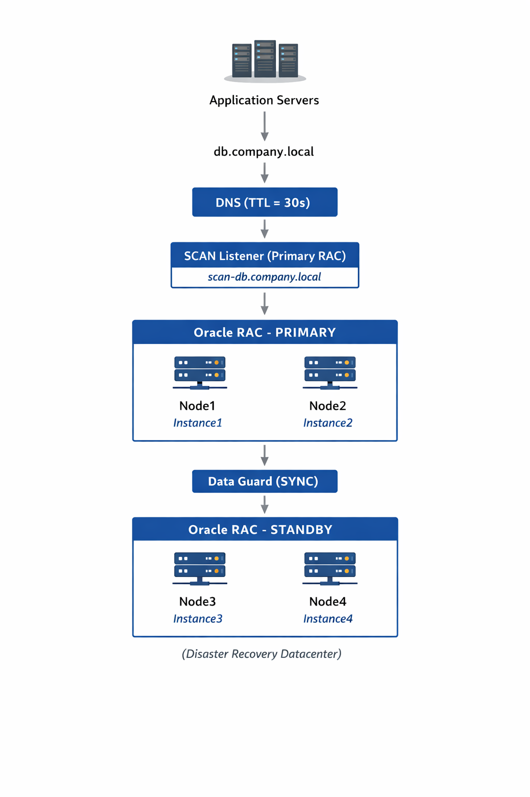

# Production-Ready Oracle Database Architecture
### High Availability, Disaster Recovery and Observability
### SRE Technical Assignment

---

## Overview
The proposed architecture is designed to provide high availability (HA), fault tolerance, and disaster recovery (DR) for a production-grade database system.

The system leverages Oracle Real Application Clusters (RAC) to ensure high availability within the primary datacenter and Oracle Data Guard to provide disaster recovery across geographically separated datacenters.

Application servers connect to the database through a DNS-based abstraction layer, allowing seamless traffic redirection during failover events without requiring application configuration changes.

The architecture follows common SRE principles including:

- Redundancy across multiple layers
- Automated failover mechanisms
- Observability and proactive monitoring
- Disaster recovery readiness
- Infrastructure designed for horizontal scalability

---

## Key design goals

- Zero or near-zero data loss
- High availability within a datacenter
- Disaster recovery across datacenters
- Transparent failover for applications
- Minimal operational complexity

---

## Architecture Overview

*Figure 1: High Availability Oracle Database Architecture using RAC and Data Guard.*

---

## Architecture Summary

The following diagram summarizes the high-level architecture and data flow between application servers and the database clusters.

```text
                Application Servers
                       |
                db.company.local
                       |
                 DNS (TTL = 30s)
                       |
                SCAN Listener (Primary RAC)
                scan-db.company.local
                       |
        +----------------------------------+
        |        Oracle RAC - PRIMARY      |
        |                                  |
        |      Node1           Node2       |
        |    Instance1       Instance2     |
        +----------------------------------+
                       |
               Data Guard (SYNC)
                       |
        +----------------------------------+
        |        Oracle RAC - STANDBY      |
        |                                  |
        |      Node3           Node4       |
        |    Instance3       Instance4     |
        +----------------------------------+
               (Disaster Recovery DC)
```

---

## Technical Design Document Structure
The detailed technical design and implementation documentation
is organized in the /docs directory.

- 01 – Infrastructure preparation
- 02 – Network and DNS configuration
- 03 – Shared storage and ASM disks
- 04 – Operating system configuration
- 05 – Oracle Grid Infrastructure installation
- 06 – Oracle RAC database installation
- 07 – Data Guard configuration
- 08 – Backup strategy
- 09 – Monitoring and observability
- 10 – Failover and recovery scenarios
- 11 – Automation strategy

---

## Architecture Detail

This architecture is designed to ensure high availability, fault tolerance, and disaster recovery for a production Oracle database environment. The solution combines Oracle Real Application Clusters (RAC) for intra-site high availability and Oracle Data Guard for cross-site disaster recovery.

### 1. Application Connection Layer

Applications do not connect directly to a specific database node.
Instead, they connect using a logical database endpoint:
```text
db.company.local
```

This abstraction layer allows the infrastructure team to redirect traffic to a different database cluster during failover events without modifying application configurations.

Application connection flow:
```text
      Application
         ↓
      db.company.local
         ↓
      DNS Resolution
         ↓
      SCAN Listener
         ↓
      Oracle RAC
```

### 2. DNS Layer

The DNS entry:
```text
db.company.local
```

is configured with a TTL (Time-To-Live) of 30 seconds.

This short TTL ensures that application servers refresh the database endpoint frequently, allowing quick redirection during disaster recovery scenarios.

Example DNS mapping:
```text
db.company.local → scan-db.company.local
```

During a disaster recovery failover, this DNS record can be updated to point to the standby site:
```text
db.company.local → scan-standby.company.local
```

Because of the 30-second TTL, applications will reconnect to the new database endpoint shortly after the DNS change.

### 3. SCAN Listener Layer

Oracle SCAN (Single Client Access Name) provides a unified entry point for database connections.

Instead of connecting directly to individual RAC nodes, applications connect to a SCAN address such as:
```text
scan-db.company.local
```

The SCAN listener provides several important capabilities:
- Connection load balancing across RAC nodes
- Automatic redirection to available instances
- Simplified client configuration
- Seamless failover when a node becomes unavailable

Typically, SCAN resolves to multiple virtual IP addresses managed by Oracle Clusterware.

### 4. Oracle RAC – Primary Cluster

The primary database cluster consists of two nodes running Oracle Real Application Clusters (RAC).
```text
Node1 : Instance1
Node2 : Instance2
```

Both instances access a shared database storage and operate simultaneously.

Oracle RAC provides:
- Active-active database instances
- Load balancing across nodes
- Automatic instance failover
- Continuous service availability

If one node fails, the remaining node continues serving database requests with minimal disruption.

Oracle Clusterware continuously monitors node health and automatically evicts failed nodes from the cluster to prevent split-brain scenarios.

This quorum-based mechanism ensures cluster consistency and prevents multiple nodes from acting as primary simultaneously.

### 5. Data Guard Replication

Oracle Data Guard is used to replicate data from the primary cluster to a standby cluster located in a separate datacenter.

Replication mode:
```text
SYNC (Synchronous Redo Transport)
```

In synchronous mode:
- Transactions are committed only after redo is written to both primary and standby systems.
- This ensures zero data loss.

Benefits:
- Strong data consistency
- Immediate disaster recovery readiness
- RPO close to zero

### 6. Standby RAC Cluster (Disaster Recovery Site)

The disaster recovery site contains another Oracle RAC cluster with two nodes:
```text
Node3 : Instance3
Node4 : Instance4
```

The standby cluster continuously receives redo logs from the primary cluster through Data Guard.

The standby database remains synchronized and ready for activation in case of a primary site failure.

Advantages of using RAC at the standby site:
- Immediate scalability after failover
- High availability even in the DR site
- Faster recovery operations

### 7. Failover Scenario

If the primary datacenter becomes unavailable, the following recovery procedure is performed:
- Detect primary cluster failure via monitoring alerts or health checks
- Promote the standby database using Data Guard failover
- Activate the standby RAC as the new primary database
- Update DNS entry:
```text
db.company.local → scan-standby.company.local
```
- Applications reconnect automatically after DNS refresh.

Because DNS TTL is configured to 30 seconds, most applications reconnect within 30–60 seconds.

### 8. High Availability and Disaster Recovery Strategy

This architecture provides two levels of resilience:

- **Intra-Datacenter High Availability** – Provided by **Oracle RAC**
  - Node failure does not impact overall database availability
  - Sessions automatically reconnect to surviving instances

- **Cross-Datacenter Disaster Recovery** – Provided by **Oracle Data Guard**
  - Standby cluster located in a separate datacenter
  - Continuous replication ensures minimal or zero data loss

### 9. Target Availability Objectives

The architecture is designed to achieve the following targets:
- Availability (SLO): 99.99%
- Recovery Time Objective (RTO): 5 – 10 minutes
- Recovery Point Objective (RPO): 0 seconds (SYNC replication)