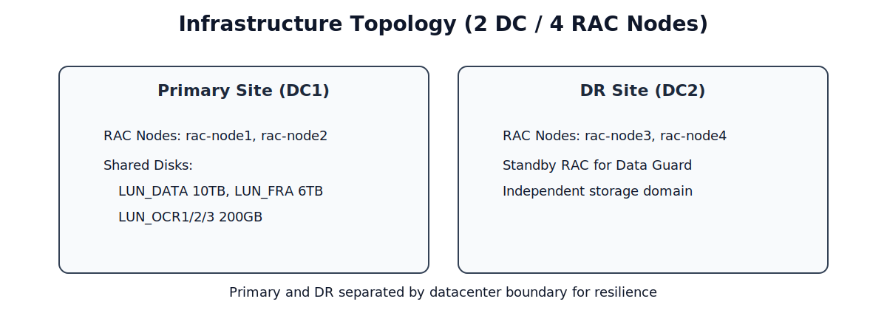

# 01 - Infrastructure Preparation

## Overview

This section describes the infrastructure requirements for deploying the production-ready Oracle RAC and Data Guard environment.  
The deployment is designed for a virtualized environment using VMware vSphere and spans across two datacenters to ensure high availability and disaster recovery.

The infrastructure preparation includes:

- Virtual machine provisioning
- Network layout
- Shared storage configuration
- ASM disk layout planning

The goal is to establish a stable infrastructure foundation before installing Oracle Grid Infrastructure and Oracle RAC.

---

## Platform

The environment is deployed on the following virtualization platform:
```text
Platform: VMware vSphere
Hypervisor: VMware ESXi
```

The infrastructure is distributed across two datacenters:

- **Primary Datacenter**
  - RAC Node 1
  - RAC Node 2

- **Disaster Recovery Datacenter**
  - RAC Node 3
  - RAC Node 4

Each datacenter hosts two Oracle RAC nodes to ensure redundancy and high availability.

---

## Virtual Machine Configuration

Each Oracle RAC node is deployed as a dedicated virtual machine with the following specifications:

| Resource | Specification |
|--------|--------|
| CPU | 32 vCPU |
| Memory | 128 GB RAM |
| System Disk | 1 TB |
| Operating System | Oracle Linux 8 Update 8 |
| Database Version | Oracle Database 21c |

Total nodes:
```text
4 Virtual Machines
```

Node naming convention:
```text
rac-node1 (Primary DC)
rac-node2 (Primary DC)

rac-node3 (DR DC)
rac-node4 (DR DC)
```

---

## Network Architecture

Each RAC node uses multiple network interfaces to separate different types of traffic.

| Network Type | Purpose |
|--------|--------|
| Client Access Network | Application database connections |
| Private Interconnect | RAC node communication and cache fusion |
| Management Network | System administration and monitoring |

Example network layout (Primary Datacenter):

```text
Client Access Network   : 192.168.10.0/24
Private Interconnect    : 192.168.20.0/24
Management Network      : 192.168.30.0/24
```

Example network layout (DR Datacenter):
```text
Client Access Network   : 192.168.110.0/24
Private Interconnect    : 192.168.120.0/24
Management Network      : 192.168.130.0/24
```

The private interconnect network is used by Oracle Clusterware for node heartbeat and cache fusion traffic.

Oracle Data Guard redo transport occurs over the client access network between the primary and standby clusters.

---

## Shared Storage Configuration

Shared storage is provided separately in each datacenter.
Each RAC cluster accesses its own shared storage locally.

Shared storage is provisioned from an enterprise SAN storage system and presented to the RAC nodes as multiple LUNs.

These LUNs are typically accessed using multipath I/O to ensure redundancy and eliminate single points of failure in the storage path.

Example storage layout:

| LUN | Purpose | Size |
|-----|--------|------|
| LUN_DATA | Database datafiles | 10 TB |
| LUN_FRA | Fast Recovery Area | 6 TB |
| LUN_OCR1 | OCR / Voting disk | 200 GB |
| LUN_OCR2 | OCR / Voting disk | 200 GB |
| LUN_OCR3 | OCR / Voting disk | 200 GB |

Total shared disks:
```text
5 disks
```

These disks will later be used to create Oracle ASM disk groups for database storage and cluster metadata.

---

## ASM Disk Layout

Oracle ASM (Automatic Storage Management) is used to manage database storage.

The disk groups are organized as follows:

| ASM Disk Group | Purpose |
|--------|--------|
| +DATA | Database files |
| +FRA | Backup and archive logs |
| +OCR | Cluster metadata (OCR and voting disks) |

Example layout:
```text
+DATA -> DATA disk (10 TB)
+FRA -> FRA disk (6 TB)
+OCR -> OCR1, OCR2, OCR3 (200 GB each)
```

This layout ensures separation of database data, recovery files, and cluster metadata.

---

## Node Distribution

The nodes are distributed across two datacenters to ensure disaster recovery capability.


*Figure: Two-datacenter infrastructure with primary and DR RAC node distribution.*

```text
Primary Datacenter:
rac-node1
rac-node2

Disaster Recovery Datacenter:
rac-node3
rac-node4
```

The primary datacenter hosts the **primary Oracle RAC database**, while the secondary datacenter hosts the **standby RAC cluster** used for Data Guard replication.

---

## Infrastructure Summary
```text
Total Datacenters: 2

Total RAC Nodes: 4

Primary Site:
rac-node1
rac-node2

DR Site:
rac-node3
rac-node4

Shared Disks:
LUN_DATA 10TB
LUN_FRA 6TB
LUN_OCR1 200GB
LUN_OCR2 200GB
LUN_OCR3 200GB
```

This infrastructure provides the foundation required to deploy a highly available Oracle RAC cluster with cross-datacenter disaster recovery using Oracle Data Guard.

---

## Availability Design

The system is designed to achieve high availability through multiple layers:

Database Layer
- Oracle RAC provides node-level high availability within each datacenter.
- If one RAC node fails, database services automatically failover to the remaining node.

Datacenter Layer
- Oracle Data Guard provides disaster recovery between the primary and standby clusters.
- In case of a full primary site outage, the standby cluster can be promoted to primary.

Storage Layer
- SAN storage uses multipath I/O to eliminate single points of failure.

Network Layer
- Multiple network interfaces separate client traffic, cluster interconnect, and management traffic.

---

## Next Steps

After completing the infrastructure preparation, the next step is to configure the network and DNS environment required for Oracle RAC and application connectivity.

See:
[02-network-and-dns-configuration.md](./02-network-and-dns-configuration.md)

