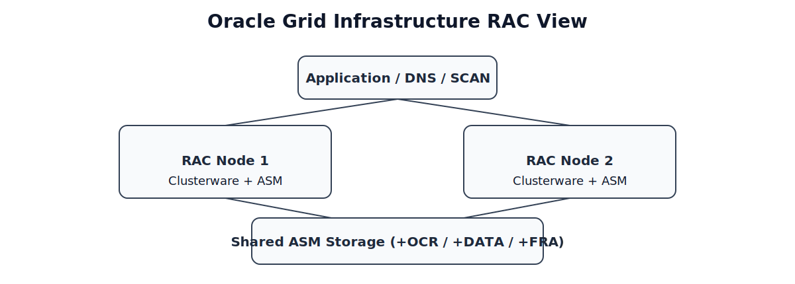

# 04 - Oracle Grid Infrastructure Installation

## Overview

This section describes the installation and configuration of Oracle Grid Infrastructure 21c for an Oracle RAC environment.

Oracle Grid Infrastructure provides the core components required for Oracle RAC, including:

- Oracle Clusterware
- Oracle ASM (Automatic Storage Management)
- SCAN Listener
- Cluster resource management

This guide installs Grid Infrastructure on a 2-node Oracle RAC cluster:

```text
rac01
rac02
```

---

## Environment

| Component | Value |
|----------|------|
| OS | Oracle Linux 8 Update 8 |
| Database | Oracle 21c |
| Nodes | 2 |
| Storage | ASM |

---

## Architecture Components

Oracle Grid Infrastructure includes the following major components:

| Component          | Description                                               |
| ------------------ | --------------------------------------------------------- |
| Oracle Clusterware | Manages cluster membership, node monitoring, and failover |
| Oracle ASM         | Manages shared storage for database files                 |
| SCAN Listener      | Provides load-balanced database connection endpoint       |
| ASM Disk Groups    | Logical storage groups used by Oracle Database            |

In this architecture:


*Figure: Application entry through SCAN to RAC nodes over shared ASM storage.*

```text
Application
     |
 Load Balancer / DNS
     |
     SCAN
     |
+------------+      +------------+
| RAC Node 1 | <--> | RAC Node 2 |
+------------+      +------------+
       \              /
        \            /
         \          /
        Shared ASM Storage
```

---

## Installation Prerequisites

Before installing Oracle Grid Infrastructure, ensure the following prerequisites are completed.

### OS Configuration

Each RAC node must be configured with:

- Oracle Linux / RedHat compatible OS
- Required kernel parameters
- Required OS packages

---

## Lab Installation Steps (Detail)

> Run the steps on both nodes unless specified otherwise.

### 1. Configure Hosts File (do on both node)

```bash
nano /etc/hosts
```

```text
192.168.10.11 rac01
192.168.10.12 rac02

192.168.10.21 rac01-vip
192.168.10.22 rac02-vip

192.168.20.11 rac01-priv
192.168.20.12 rac02-priv
```

### 2. Open Required Firewall Ports

```bash
sudo firewall-cmd --permanent --add-port=1521/tcp
sudo firewall-cmd --permanent --add-port=5432/tcp
sudo firewall-cmd --permanent --add-port=2100/tcp
sudo firewall-cmd --permanent --add-port=3260/tcp
sudo firewall-cmd --permanent --add-port=6200/tcp
sudo firewall-cmd --permanent --add-port=2016/tcp
sudo firewall-cmd --permanent --add-port=1158/tcp
sudo firewall-cmd --permanent --add-port=9000-9100/tcp
sudo firewall-cmd --permanent --add-port=5556/tcp
sudo firewall-cmd --permanent --add-port=7070/tcp
sudo firewall-cmd --permanent --add-port=42424/tcp
sudo firewall-cmd --permanent --add-port=4888/tcp
```

Reload firewall rules:

```bash
sudo firewall-cmd --reload
```

Check firewall configuration:

```bash
sudo firewall-cmd --list-all
```

Disable firewall:
```bash
systemctl stop firewalld
systemctl disable firewalld
```

---

### 3. Create Required Users and Groups

Create Oracle required groups:

```bash
groupadd oinstall
groupadd dba
groupadd asmadmin
groupadd asmdba
groupadd asmoper
```

Group description:

| Group    | Purpose                            |
| -------- | ---------------------------------- |
| oinstall | Installation ownership             |
| dba      | Database administration privileges |
| asmadmin | ASM administration                 |
| asmdba   | ASM database access                |
| asmoper  | ASM operator privileges            |

Create grid User:

```bash
useradd -g oinstall -G asmadmin,asmdba,asmoper grid
passwd grid
```

Create oracle user:

```bash
useradd -g oinstall -G dba,asmdba oracle
passwd oracle
```

Add additional groups if needed:

```bash
sudo usermod -aG dba,asmdba oracle
```

Check user groups:

```bash
groups oracle
```

---

### 4. Create Oracle Directory Structure

Create required directories:

```bash
mkdir -p /u01/app/grid
mkdir -p /u01/app/oracle
mkdir -p /u01/app/product/db21c
mkdir -p /u01/app/oraInventory
mkdir -p /u01/app/21c/grid
mkdir -p /u01/app/grid_install
mkdir -p /u01/app/oracle_install
```

Set ownership:

```bash
chown -R grid:oinstall /u01/app/grid
chown -R oracle:oinstall /u01/app/oracle
chown -R oracle:oinstall /u01/app/product/db21c
chown -R grid:oinstall /u01/app/oraInventory
chown -R grid:oinstall /u01/app/21c
chown -R grid:oinstall /u01/app/grid_install
chown -R oracle:oinstall /u01/app/oracle_install
```

Set permissions:

```bash
chmod -R 775 /u01/app
```

---

### 5. Configure Shared Storage

This lab uses **SAN storage (LUNs)** presented to both RAC nodes.

Create the following LUNs on the SAN storage system.

| LUN Name | Size | Usage |
|----------|------|------|
| LUN_DATA | 10 TB | ASM `+DATA` disk group |
| LUN_FRA  | 6 TB  | ASM `+FRA` disk group |
| LUN_OCR1 | 200 GB | ASM `+OCR` disk group |
| LUN_OCR2 | 200 GB | ASM `+OCR` disk group |
| LUN_OCR3 | 200 GB | ASM `+OCR` disk group |

The LUNs must be presented to **both RAC nodes** using the SAN storage system.

#### Verify SAN Disks:

After presenting the LUNs to the servers, verify that the disks are visible.

```bash
lsblk
```

Example output:

```text
sdb   10T
sdc   6T
sdd   200G
sde   200G
sdf   200G
```

Check disk identifiers:

```bash
udevadm info --query=all --name=/dev/sdb | grep ID_SERIAL
```

#### Configure udev Rules for ASM

To ensure persistent disk names across reboots, configure udev rules for ASM disks.

Create the rule file:

```bash
nano /etc/udev/rules.d/99-oracle-asm.rules
```

Example configuration:

```text
KERNEL=="sdb", OWNER="grid", GROUP="asmadmin", MODE="0660", SYMLINK+="RAC_DATA_01"
KERNEL=="sdc", OWNER="grid", GROUP="asmadmin", MODE="0660", SYMLINK+="RAC_FRA_01"

KERNEL=="sdd", OWNER="grid", GROUP="asmadmin", MODE="0660", SYMLINK+="RAC_OCR_01"
KERNEL=="sde", OWNER="grid", GROUP="asmadmin", MODE="0660", SYMLINK+="RAC_OCR_02"
KERNEL=="sdf", OWNER="grid", GROUP="asmadmin", MODE="0660", SYMLINK+="RAC_OCR_03"
```

Reload rules:

```bash
udevadm control --reload-rules
udevadm trigger
```

Verify the ASM disks:

```bash
ls -l /dev/RAC_*
```

Example output:

```text
/dev/RAC_DATA_01
/dev/RAC_FRA_01
/dev/RAC_OCR_01
/dev/RAC_OCR_02
/dev/RAC_OCR_03
```

These device paths will be used later when creating ASM disk groups during the Grid Infrastructure installation.

> In production environments, SAN disks are typically accessed through **multipath devices (/dev/mapper/mpathX)** instead of raw block devices.

---

### 6. Install GUI Environment

Install GUI:

```bash
yum -y groups install "Server with GUI"
```

Configure Xfce:

```bash
echo "exec /usr/bin/xfce4-session" >> ~/.xinitrc
startx
```

Install VNC server:

```bash
yum -y install tigervnc-server
```

Allow VNC firewall access:

```bash
firewall-cmd --add-service=vnc-server --permanent
firewall-cmd --reload
```

Start VNC:

```bash
vncserver :1 -geometry 1024x768 -depth 24
```

---

### 7. Configure SSH Equivalency

Login as grid user:

```bash
su - grid
```

Generate key:

```bash
ssh-keygen -t rsa
```

Copy key:

```bash
ssh-copy-id grid@rac02
ssh-copy-id grid@rac01
```

Repeat the same process for oracle user.

Test SSH:

```bash
ssh rac02
```

---

### 8. Configure /dev/shm and Hugepage

> For servers with 128GB RAM, a shared memory size of 120GB and swap size of 16GB is commonly used in Oracle database environments.

Set shared memory size close to system RAM (typically 80%–95%).

```bash
umount /dev/shm
mount -t tmpfs tmpfs -o size=120G /dev/shm
```

Persist configuration:

```bash
nano /etc/fstab
```

```text
tmpfs   /dev/shm        tmpfs   defaults,size=120G        0       0
```

Reload systemd:

```bash
systemctl daemon-reload
```

#### Configure HugePages for Oracle RAC

HugePages improve memory management for Oracle databases by allocating large memory pages for the SGA, reducing CPU overhead and memory fragmentation.

For servers with large RAM (≥ 64GB), Oracle strongly recommends enabling HugePages.

First check HugePage size:

```bash
grep Hugepagesize /proc/meminfo
```

Example output:

```text
Hugepagesize:       2048 kB
```

This means the HugePage size is 2MB.

> HugePage size is determined by the Linux kernel and is typically **2MB** on most distributions.

Assume the planned SGA size = 96GB.

Calculate required HugePages:

```text
96GB / 2MB = 49152 pages
```

Configure HugePages:

```bash
nano /etc/sysctl.conf
```

Add the following parameter:

```text
vm.nr_hugepages = 49152
```

Apply the configuration:

```bash
sysctl -p
```

Verify HugePages configuration:

```bash
grep Huge /proc/meminfo
```

Example output:

```text
HugePages_Total:   49152
HugePages_Free:    49152
Hugepagesize:      2048 kB
```

These HugePages will be reserved for Oracle SGA memory allocation.

#### Disable Swap Aggressiveness

To prevent the database memory from being swapped to disk, reduce the Linux swappiness value.

Edit system configuration:

```bash
nano /etc/sysctl.conf
```

Add:

```text
vm.swappiness = 1
```

Apply the configuration:

```bash
sysctl -p
```

This ensures the Oracle database prioritizes RAM usage instead of swapping memory to disk.

---

### 9. Configure Swap

Create swap file:

```bash
dd if=/dev/zero of=/swapfile bs=1G count=16
mkswap /swapfile
swapon /swapfile
```

verify:

```bash
free -h
```

Add to fstab:

```bash
/swapfile swap swap defaults 0 0
```

---

### 10. Copy Oracle Installation Files

Copy the following zip files:

```text
Grid Infrastructure
Oracle Database
```

Destination:

```text
/u01/app/grid_install
/u01/app/oracle_install
```

---

### 11. Extract Oracle Grid zip

Login as grid user:

```bash
su - grid
```

Extract Oracle Grid Infrastructure installation files:

```bash
unzip /u01/app/grid_install/LINUX.X64_213000_grid_home.zip -d /u01/app/21c/grid
```

---

### 12. Configure Grid Environment

Create environment file:

```bash
nano /home/grid/setEnv.sh
```

rac01:

```text
export ORACLE_BASE=/u01/app/grid
export ORACLE_HOME=/u01/app/21c/grid
export GRID_HOME=/u01/app/21c/grid
export ORACLE_SID=+ASM1
export PATH=$ORACLE_HOME/bin:$PATH
```

rac02:

```text
export ORACLE_BASE=/u01/app/grid
export ORACLE_HOME=/u01/app/21c/grid
export GRID_HOME=/u01/app/21c/grid
export ORACLE_SID=+ASM2
export PATH=$ORACLE_HOME/bin:$PATH
```

Add to profile:

```bash
echo ". /home/grid/setEnv.sh" >> ~/.bash_profile
source ~/.bash_profile
```

---

### 13. Start Grid Installer

Start VNC:

```bash
vncserver :1 -geometry 1024x768 -depth 24
```

Set display:

```bash
export DISPLAY=:1
```

Run installer:

```bash
nohup /u01/app/21c/grid/gridSetup.sh > /u01/app/21c/grid/grid_setup.log 2>&1 &
```

---

### 14. Grid Installation Configuration

#### 14.1. Cluster Configuration

```text
Cluster Name: rac
SCAN Name: scan-db.company.local
SCAN Port: 1521
```

#### 14.2. Add Nodes

```text
Public hostname: rac01    Virtual hostname: rac01-vip
Public hostname: rac02    Virtual hostname: rac02-vip
```

#### 14.3. Network Interfaces

| Interface | Network Type | Example Subnet | Purpose |
|-----------|-------------|---------------|---------|
| enp0s3 | Public Network | 192.168.10.0/24 | Client database connections |
| enp0s8 | Private Interconnect | 192.168.20.0/24 | RAC Cache Fusion communication |

> The private interconnect network is used by Oracle RAC instances for **Cache Fusion** traffic and should be configured with low latency and high bandwidth.

#### 14.4. ASM Disk Group

Disk group name:

```text
OCR
```

Discovery path:

```text
/dev/RAC*
```

Selected disks:

```text
RAC_OCR_01
RAC_OCR_02
RAC_OCR_03
```

ASM password:

```text
oracle
```

#### 14.5. Check CRS Services

Configure CRS environment for root:

```bash
nano /home/root/setEnv.sh
```

```text
export ORACLE_HOME=/u01/app/21c/grid
export GRID_HOME=/u01/app/21c/grid
export PATH=$ORACLE_HOME/bin:$PATH
```

Load environment:

```bash
source /root/.bash_profile
```

Check CRS:

```bash
crsctl check crs
```

Restart CRS:

```bash
crsctl stop crs
crsctl start crs
```

---

### 15. Configure ASM Disk Groups

Run ASMCA:

```bash
su - grid
vncserver :1 -geometry 1024x768 -depth 24
export DISPLAY=:1
nohup /u01/app/21c/grid/bin/asmca > /tmp/asmca_setup.log 2>&1 &
```

Create disk groups.

#### 15.1. DATA

```text
Disk Group Name: DATA
Redundancy: External
Disk: /dev/RAC_DATA_01
```

#### 15.2. FRA

```text
Disk Group Name: FRA
Redundancy: External
Disk: /dev/RAC_FRA_01
```

### 16. Installation Completed

After completing these steps:

- Oracle Clusterware is running
- ASM disk groups are configured
- RAC infrastructure is ready

---

## Next Steps

See:
[05-oracle-rac-database-installation.md](./05-oracle-rac-database-installation.md)

