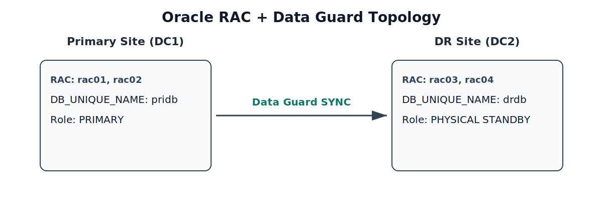

# 09 - Failover and Disaster Recovery

## Overview

This section defines the failover and disaster recovery (DR) runbook for the Oracle RAC + Data Guard architecture.

The objective is to restore database service quickly and safely when major incidents occur, including complete primary site outages.

This runbook covers:

- Planned role transition (switchover)
- Unplanned site outage (failover)
- DNS cutover for application continuity
- Post-failover stabilization and reinstate
- DR testing and readiness validation

---

## DR Topology Summary


*Figure: Primary and DR topology with Data Guard SYNC replication.*

```text
Primary Site (DC1)
  RAC: rac01, rac02
  DB_UNIQUE_NAME: pridb
  Role: PRIMARY
         ||
         || Data Guard SYNC
         \/
DR Site (DC2)
  RAC: rac03, rac04
  DB_UNIQUE_NAME: drdb
  Role: PHYSICAL STANDBY
```

Client endpoint:

```text
db.company.local
```

Normal state:

```text
db.company.local -> scan-db.company.local
```

After DR failover:

```text
db.company.local -> scan-standby.company.local
```

---

## Recovery Targets

| Target | Value |
|-------|-------|
| RPO | 0 seconds (SYNC mode target) |
| RTO | 5-15 minutes for site failover |
| DNS TTL | 30 seconds |
| Service Validation Time | <= 10 minutes after role transition |

---

## Failover Decision Criteria

Trigger DR failover only when:

- Primary site is fully unavailable or unrecoverable within business RTO
- Split-brain risk is eliminated (primary cannot still serve writes)
- DR site health is validated for promotion
- Incident commander and DBA on-call approve execution

Inputs for decision:

- Infrastructure/network status from monitoring
- Data Guard broker status
- Last transport/apply lag snapshot
- Business impact and outage duration estimate

---

## Pre-Operation Validation Checklist

Before switchover/failover:

- Confirm current Data Guard configuration is `SUCCESS`
- Confirm standby apply is running
- Validate no critical storage/cluster alarms on DR site
- Validate listener/SCAN on DR site
- Confirm application team and stakeholders are informed
- Freeze non-essential changes during operation window

Validation commands:

```bash
dgmgrl sys@pridb_sync "show configuration"
dgmgrl sys@pridb_sync "show database verbose drdb"
srvctl status database -d drdb
srvctl status scan_listener
```

---

## Procedure A: Planned Switchover

Use case:

- Primary maintenance
- DR drill
- Controlled role transition with no data loss expectation

### Step 1. Check readiness

```bash
dgmgrl sys@pridb_sync "show configuration"
```

### Step 2. Execute switchover

```bash
dgmgrl sys@pridb_sync "switchover to drdb"
```

### Step 3. Validate new roles

```bash
dgmgrl sys@drdb_sync "show configuration"
```

Expected:

- `drdb` becomes `PRIMARY`
- `pridb` becomes `PHYSICAL STANDBY`

### Step 4. Update DNS endpoint

```text
db.company.local -> scan-standby.company.local
```

### Step 5. Validate application connectivity

- Run connection tests from application hosts
- Validate read/write transaction path
- Monitor error rates and latency for 15-30 minutes

---

## Procedure B: Unplanned Failover (Primary Outage)

Use case:

- Full primary site outage
- Primary cluster unavailable for recovery within RTO

### Step 1. Confirm outage and isolate old primary

- Confirm primary is unreachable for database service
- Ensure old primary cannot accept writes
- Confirm no network partition causing dual-primary risk

### Step 2. Check standby readiness

```bash
dgmgrl sys@drdb_sync "show configuration"
```

### Step 3. Execute failover on DR site

```bash
dgmgrl sys@drdb_sync "failover to drdb"
```

### Step 4. Confirm DR is primary

```bash
dgmgrl sys@drdb_sync "show configuration"
sqlplus / as sysdba
SELECT name, open_mode, database_role FROM v$database;
```

### Step 5. Redirect client traffic

Update DNS:

```text
db.company.local -> scan-standby.company.local
```

Because TTL is 30s, most clients reconnect in 30-60 seconds.

### Step 6. Validate service health

- Check login success from app tier
- Check core transactions
- Check RAC services and listener status
- Monitor alert logs for ORA errors

---

## Post-Failover Stabilization

After DR promotion:

- Confirm backup jobs run on new primary
- Recheck FRA usage and archivelog generation
- Review performance baseline (CPU, I/O, top waits)
- Verify monitoring and alert routing now point to new primary
- Publish incident update and operational status

---

## Reinstatement and Failback

When original primary site is restored:

### Option 1. Reinstate old primary (preferred)

```bash
dgmgrl sys@drdb_sync "reinstate database pridb"
```

Then validate it as standby:

```bash
dgmgrl sys@drdb_sync "show configuration"
```

### Option 2. Rebuild old primary as standby

If reinstate fails, recreate standby using RMAN duplicate from current primary (`drdb`).

### Planned failback to original site

After stabilization and business approval:

- Execute planned switchover back to original site
- Update DNS endpoint back to primary SCAN
- Validate application and monitoring

---

## DNS and Application Cutover Guidance

Application dependency:

- Applications must connect through logical endpoint `db.company.local`
- Do not hardcode node VIP/IP addresses

Cutover rules:

- Keep TTL low (30s) for fast redirection
- Flush DNS cache on critical app servers if needed
- Validate JDBC/connection pool retry behavior

Recommended app settings:

- Connection timeout <= 10s
- Retry logic enabled
- Idle connection validation enabled in pool

---

## DR Test Plan (Quarterly)

Minimum quarterly DR drill:

1. Validate standby health and lag
2. Execute planned switchover to DR
3. Run application smoke tests
4. Measure actual RTO and impact
5. Switchover back to original primary
6. Document findings and improvement actions

Track metrics:

- Actual RTO
- Data loss observed (RPO)
- Application reconnection time
- Number of manual interventions
- Errors during role transition

---

## Runbook Roles and Responsibilities

| Role | Responsibility |
|------|----------------|
| Incident Commander | Decision authority and communication |
| DBA On-call | Execute Data Guard role transition |
| SRE/Infra | Validate network, DNS, and platform health |
| Application Owner | Run smoke tests and business verification |
| Service Desk | Stakeholder notification and ticket tracking |

---

## Communication Template (During DR Event)

Minimum updates to stakeholders:

- Incident start time and impacted services
- Current database role/state
- Action in progress (failover/switchover/DNS cutover)
- Estimated recovery timeline
- Confirmation when service is restored

---

## Common Failure Points and Mitigation

- Broker configuration errors:
  - Mitigation: validate broker status daily and after changes
- DNS cutover delays:
  - Mitigation: enforce low TTL and test resolver behavior
- Standby lag spikes before failover:
  - Mitigation: alert on lag thresholds and tune transport/apply
- Missing backup after role change:
  - Mitigation: automate backup target switch by role detection

---

## Summary

This failover and DR runbook provides a structured approach for both planned and unplanned role transitions in Oracle Data Guard environments.

Key outcomes:

- Clear decision criteria before triggering failover
- Repeatable execution steps for switchover/failover
- Fast client redirection through DNS abstraction
- Defined post-failover stabilization and failback process

This process supports production resilience and predictable recovery during major outages.

---

## Next Steps

See:
[10-automation-strategy.md](./10-automation-strategy.md)

