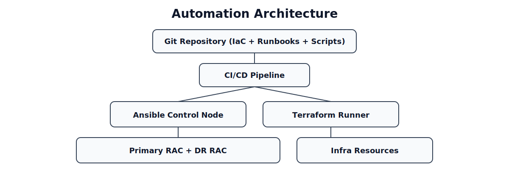
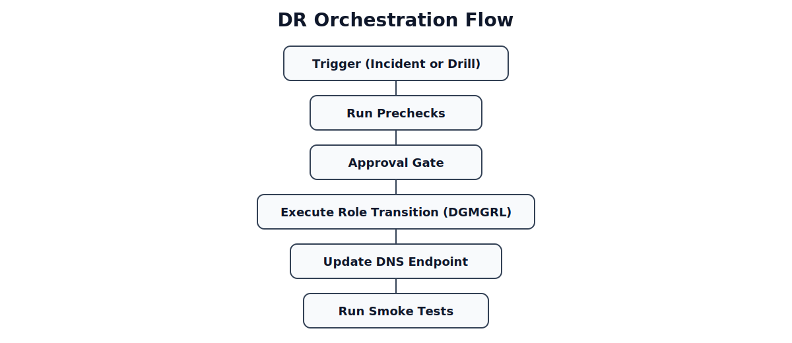

# 10 - Automation Strategy

## Overview

This section defines the automation strategy for operating Oracle RAC + Data Guard at production scale.

The objective is to reduce manual operations, improve consistency, and shorten incident recovery time while maintaining strong change control.

Automation scope includes:

- Infrastructure provisioning
- OS and database configuration management
- Backup and recovery operations
- Monitoring and alert automation
- Failover orchestration and DR drills
- Compliance, audit, and governance workflows

This document is the summary layer for the automation design.

Detailed implementation guidance is split into the following companion documents:

- [10-01-automation-platform-and-delivery-model.md](./10-01-automation-platform-and-delivery-model.md)  
  Defines the automation platform, repository layout, CI/CD pipeline, approval model, execution flow, and rollback controls.
- [10-02-vm-and-os-provisioning-automation.md](./10-02-vm-and-os-provisioning-automation.md)  
  Describes automated VM provisioning and OS installation for VMware vSphere and OpenStack, including templates, Kickstart, cloud-init, and validation flow.
- [10-03-network-configuration-automation.md](./10-03-network-configuration-automation.md)  
  Covers guest OS network automation for interface mapping, static IP configuration, VLAN, bonding, routing, MTU, and post-change validation.
- [10-04-dns-and-service-endpoint-automation.md](./10-04-dns-and-service-endpoint-automation.md)  
  Details automation for host records, VIP, SCAN, logical database endpoints, TTL policy, and DR DNS cutover workflow.
- [10-05-os-baseline-and-oracle-prerequisite-automation.md](./10-05-os-baseline-and-oracle-prerequisite-automation.md)  
  Defines automated OS baseline hardening and Oracle prerequisite setup, including packages, users, kernel parameters, limits, and readiness checks.

---

## Automation Principles

Automation in this architecture follows these principles:

- Everything as code (infrastructure, configuration, runbooks)
- Idempotent execution (safe reruns)
- Standardized environments across primary and DR sites
- Role-based and approval-based execution for high-risk actions
- Full auditability of every automated change

---

## Target Automation Domains

| Domain | Objective | Suggested Tools |
|-------|-----------|-----------------|
| Infrastructure Provisioning | Consistent host/network/storage build | Terraform, Ansible |
| OS Hardening & Baseline | Standard packages, kernel params, users/groups | Ansible |
| Oracle Configuration | Listener, tnsnames, RMAN, Data Guard params | Ansible, shell |
| Job Scheduling | Backup, health check, validation tasks | cron, enterprise scheduler |
| Monitoring Setup | Exporters, dashboards, alerts as code | Prometheus stack, Grafana |
| DR Orchestration | Switchover/failover workflow automation | Ansible, orchestrator pipeline |
| Compliance & Audit | Change records and execution logs | Git + CI/CD + ticketing |

---

## Automation Architecture


*Figure: GitOps pipeline feeding Ansible/Terraform execution domains.*

```text
Git Repository (IaC + Runbooks + Scripts)
                |
           CI/CD Pipeline
                |
   +------------+-------------+
   |                          |
Ansible Control Node      Terraform Runner
   |                          |
Primary RAC + DR RAC      Infra Resources
   |
Execution Logs + Metrics + Alerts
```

Key concept:

- Git is the single source of truth
- Pipeline enforces validation before execution
- Production changes require approval gates

---

## Repository Structure (Recommended)

```text
automation/
  terraform/
    network/
    compute/
    storage/
  ansible/
    inventories/
      prod/
      dr/
    roles/
      os_baseline/
      oracle_prereq/
      grid_config/
      db_config/
      dataguard/
      monitoring_agent/
  scripts/
    rman/
    dataguard/
    healthchecks/
  pipelines/
    ci.yml
    cd.yml
  docs/
    runbooks/
```

---

## Infrastructure as Code Strategy

Automate provisioning of:

- VM or bare-metal profiles
- VLAN/subnet and routing definitions
- DNS records (`db.company.local`, SCAN aliases)
- Shared storage mappings
- Security groups/firewall baseline

IaC requirements:

- Use reusable modules for primary and DR
- Parameterize environment differences (IP ranges, hostnames)
- Enforce naming standards and tagging
- Keep state backend protected and access-controlled

---

## Configuration Management Strategy

Automate OS and Oracle prerequisites:

- Kernel parameters and limits
- Required packages and services
- User/group creation
- Oracle env files and profile settings
- Listener and `tnsnames.ora` templates
- RMAN policy deployment
- Data Guard Broker startup and validation scripts

Execution model:

- Apply baseline to all nodes
- Apply role-specific tasks (primary vs standby)
- Run post-check validation after each playbook

---

## Database Operational Automation

### 1. Backup Automation

- Schedule RMAN Level 0/1 and archivelog backups
- Auto-rotate logs
- Auto-validate backup success and age
- Auto-open ticket/alert on failure

### 2. Data Guard Health Automation

- Periodic broker status checks
- Transport/apply lag threshold checks
- Automatic evidence collection for incident triage

### 3. Capacity Automation

- Daily FRA and tablespace usage snapshots
- Growth trend reports
- Proactive capacity alert generation

---

## Failover Automation Strategy

Failover must be semi-automated with guardrails.

Automate:

- Pre-checks (broker status, standby health, lag, cluster state)
- Execution steps (`switchover`/`failover`) via controlled scripts
- DNS update workflow
- Post-check validation and report generation

Keep manual approval for:

- Final failover execution in production
- DNS cutover confirmation
- Failback decision

---

## Example DR Orchestration Flow


*Figure: Controlled role transition workflow for DR events and drills.*

```text
Trigger (Incident or Drill)
      |
Run Prechecks
      |
Approval Gate
      |
Execute Role Transition (DGMGRL)
      |
Update DNS Endpoint
      |
Run Smoke Tests
      |
Publish Outcome + Metrics
```

---

## CI/CD for Automation Assets

Pipeline stages:

1. Lint and syntax checks (`ansible-lint`, shellcheck, YAML validation)
2. Static policy checks (naming, required tags, risky commands)
3. Dry-run execution (`ansible --check` where possible)
4. Approval gate for production
5. Controlled deployment with logs/artifacts

Branch policy:

- Changes via pull request only
- Mandatory reviewer from DBA/SRE owners
- Version tags for release bundles

---

## Safety Controls and Guardrails

Mandatory safeguards:

- No destructive command execution without explicit approval
- Environment allow-list (prod vs non-prod)
- Concurrency control to avoid parallel conflicting jobs
- Automatic rollback path for configuration changes
- Secrets never stored in plain text

Use:

- Vault/secret manager for DB credentials
- Least privilege service accounts
- Signed change artifacts where possible

---

## Observability of Automation

Track automation KPIs:

- Job success rate
- Mean execution time
- Change failure rate
- Rollback frequency
- MTTR improvement after automation rollout

Log every run with:

- Who triggered the job
- What version was executed
- Which hosts were changed
- Result and evidence links

---

## Compliance and Audit

Automation must support audit requirements:

- Immutable logs for production changes
- Ticket/reference ID for each change execution
- Evidence retention for DR drill results
- Access review for automation accounts

Recommended retention:

- Automation execution logs: 12 months
- DR drill reports: 24 months

---

## Phased Implementation Plan

### Phase 1. Foundation

- Build Git repo and CI baseline
- Automate OS baseline and Oracle prerequisites
- Standardize inventory and variables

### Phase 2. Core Operations

- Automate RMAN jobs and health checks
- Automate monitoring agent/dashboards deployment
- Add alert integrations

### Phase 3. DR Automation

- Automate switchover drill flow
- Add controlled failover orchestration
- Generate DR drill reports automatically

### Phase 4. Optimization

- Tune thresholds and reduce noisy alerts
- Add self-healing actions for known low-risk issues
- Improve reporting and executive dashboards

---

## Risks and Mitigation

| Risk | Impact | Mitigation |
|------|--------|------------|
| Incorrect automation logic | Service disruption | Peer review + staging tests |
| Credential leakage | Security incident | Vault + rotation + RBAC |
| Over-automation of critical actions | Uncontrolled failover | Approval gates + break-glass policy |
| Drift between code and environment | Inconsistent behavior | Scheduled drift detection |

---

## Summary

This automation strategy establishes a controlled, auditable, and scalable operating model for Oracle RAC + Data Guard.

Key outcomes:

- Reduced manual effort and configuration drift
- Faster and safer operational execution
- Repeatable DR operations with evidence
- Better reliability through policy-driven automation

This completes the end-to-end technical design from infrastructure setup to resilient operations.

For detailed implementation flows, continue with:

- [10-01-automation-platform-and-delivery-model.md](./10-01-automation-platform-and-delivery-model.md)
- [10-02-vm-and-os-provisioning-automation.md](./10-02-vm-and-os-provisioning-automation.md)
- [10-03-network-configuration-automation.md](./10-03-network-configuration-automation.md)
- [10-04-dns-and-service-endpoint-automation.md](./10-04-dns-and-service-endpoint-automation.md)
- [10-05-os-baseline-and-oracle-prerequisite-automation.md](./10-05-os-baseline-and-oracle-prerequisite-automation.md)
